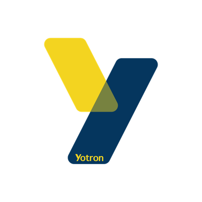

# 優創智能 Yotron AI

**台灣 AI 商業落地專家** · AI Business Deployment for Taiwanese SMEs

優創智能有限公司協助台灣中小企業把 AI 放進實際的行銷、內容與營運流程：從搜尋能見度、AI 引用，到商品圖、品牌影片與企業網站，直接交付能上線、能使用、能持續優化的成果。

成立於 2024 年。我們不只提供策略建議，也會直接 commit 進你的 repo、跑你的流程，把 AI 真正做成會帶來商業結果的系統。

## What We Do

| Track | 內容 |
| --- | --- |
| **SEO / GEO 雙引擎** | 同步優化 Google 搜尋與生成式 AI 引用；涵蓋技術 SEO、內容架構、Schema.org、GA4、GSC，以及 ChatGPT、Gemini、Perplexity、Claude 四大 AI 引擎的引用監測。 |
| **AI 影像** | 從商品白底圖、情境圖、包裝 mockup，到 AI 模特兒與品牌虛擬代言人；一次建立可跨季沿用的視覺資產。 |
| **AI 影片** | 公司宣傳、廣告投放、個人 IP 短影音、產品影片；支援 16:9、9:16、1:1 等平台比例與多語版本。 |
| **企業網站建置** | 從品牌定位、線框與視覺設計，到 Next.js 全棧開發、RWD、Core Web Vitals、Schema.org、GA4/GSC 與正式上線。 |
| **AI 商業導入** | 以 FDE（前線部署工程師）方式，把 AI 工具與自動化流程裝進企業日常工作，而不是停在策略簡報。 |

## What We Ship

- **搜尋能見度**：SEO + GEO 雙軌策略、Schema 全套部署、AI 引用監測與競品比對。
- **AI 商品與品牌素材**：60 秒產出 4 張影像；涵蓋 9 大商業影像場景。
- **AI 商業影片**：從 brief、腳本與分鏡，到 AI 產製、修正與多平台交付；支援 4 種主力影片類型。
- **企業網站**：以 SEO/GEO 友善的內容結構、可讀的結構化資料與完整分析工具，從第一行程式碼開始建立。

## Open Source

- **[transcribe-meeting](https://github.com/yotron-ai/transcribe-meeting)** — Claude Code skill：將會議錄音轉成逐字稿。使用 Whisper 全程本機執行，音檔不外傳、不需要 API 金鑰；Apple Silicon 可使用 MLX 加速，其他環境自動退回 CPU 引擎。

## Contact

- 官網：[yotron-ai.com](https://yotron-ai.com)
- Email：[info@yotron-ai.com](mailto:info@yotron-ai.com)
- 電話：[02-2720-8130](tel:0227208130)
- 地址：台北市大安區忠孝東路四段 310 號 11 樓
- 營業時間：週一至週五 10:00–19:00
- [預約 AI 諮詢](https://yotron-ai.com/contact)
